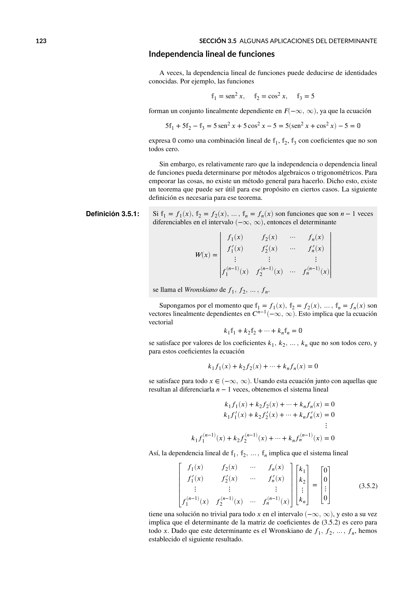

# Notas de Álgebra Lineal

Este repositorio contiene notas detalladas sobre Álgebra Lineal, incluyendo conceptos fundamentales y ejercicios prácticos. Estas notas fueron diseñadas con ayuda del profesor Luis Alfonso Godínes Contreras y se hicieron con el propósito de tener un recurso adicional para la Ingeniería Matemática.

## Contenido

- **Vectores y Espacios Vectoriales**: Definiciones, operaciones y propiedades.
- **Matrices**: Tipos, operaciones y aplicaciones.
- **Determinantes**: Cálculo y propiedades.
- **Sistemas de Ecuaciones**: Resolución y aplicaciones.
- **Transformaciones Lineales**: Conceptos y ejemplos.
- **Diagonalización**: Proceso y aplicaciones.
- **Eigenvalores y Eigenvectores**: Definiciones y aplicaciones.

## Cómo usar

Estas notas se presentan en formato PDF para facilitar su uso y visualización. Puedes clonarlas o descargarlas para estudiarlas a tu propio ritmo.

## Descarga

Puedes descargar las notas haciendo clic en el enlace que se encuentra al principio de este repositorio.

## Contribuciones

Si tienes sugerencias o mejoras, siéntete libre de abrir una *issue* o hacer un *pull request*. ¡Tu contribución es bienvenida!